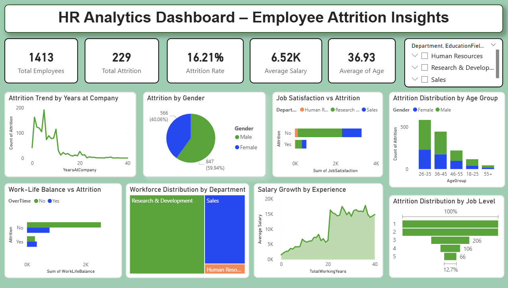

# 📊 HR Analytics Dashboard – Employee Attrition Insights
## 📌 Project Overview

This project analyzes employee attrition using HR data to identify key factors influencing employee turnover.

An interactive dashboard was built using Power BI to help HR teams understand patterns in employee behavior and make data-driven decisions to improve retention.
---
## 🎯 Business Problem
Employee attrition leads to increased hiring costs and reduced productivity.
This project answers key questions:
- What is the overall attrition rate?
- Which department has the highest attrition?
- Does overtime impact employee turnover?
- Which age group has the highest attrition?
- How does salary affect attrition?
---
## 🛠 Tools & Technologies
- Excel – Data Cleaning
- Python (Pandas) – Data Processing
- MySQL – Data Analysis
- Power BI – Dashboard Visualization
- GitHub – Project Documentation
---
## 📂 Dataset Features
| Column | Description |
|------|-------------|
| Age | Employee Age |
| Department | Department Name |
| JobRole | Job Role |
| MonthlyIncome | Salary |
| OverTime | Overtime Status |
| JobSatisfaction | Satisfaction Level |
| WorkLifeBalance | Work-Life Balance |
| YearsAtCompany | Years in Company |
| Attrition | Employee Turnover |
---
## 📊 Dashboard Features
### KPI Cards
- Total Employees
- Total Attrition
- Attrition Rate
- Average Salary
- Average Age
### Visualizations
- Attrition by Department
- Attrition by Age Group
- Attrition by Gender
- Job Satisfaction vs Attrition
- Work-Life Balance vs Attrition
- Salary Growth by Experience
- Workforce Distribution
---
## 🔍 Key Insights
- Employees working overtime have higher attrition
- Sales department has the highest turnover
- Employees aged 26–35 show highest attrition
- Lower salary employees are more likely to leave
- Poor work-life balance increases attrition risk
---
## 📊 Dashboard Preview

---
## 📁 Project Structure
HR-Analytics-Project
│
├── Dataset
├── Python
├── SQL
├── PowerBI
├── images
└── README.md
---
## 💡 Business Recommendations
- Reduce overtime workload
- Improve employee engagement
- Provide salary improvements
- Focus on retention for mid-level employees
---
## 👩‍💻 Author

Annapurna Gannarapu  
Aspiring Data Analyst  
